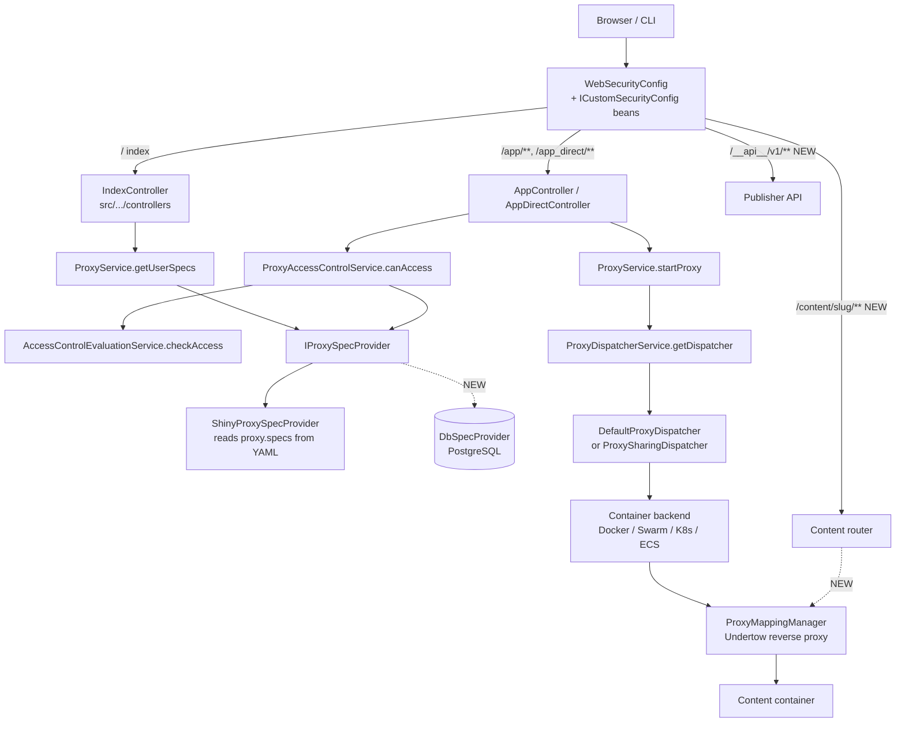

# Architecture

What ShinyProxy actually is, where the engine lives, and which seams we build on.
Verified against **ShinyProxy 3.2.4** and **ContainerProxy 1.2.4**.

> Line numbers are from ContainerProxy v1.2.4 (`github.com/openanalytics/containerproxy`,
> tag `v1.2.4`) unless the path starts with `src/`, which means this repo.

## 1. The shape of the thing

ShinyProxy is **not** the application. `pom.xml` sets the Spring Boot main class to
`eu.openanalytics.containerproxy.ContainerProxyApplication`. The engine — proxy
lifecycle, container backends, auth, routing, storage — lives in the **ContainerProxy**
library, consumed as a released jar from `nexus.openanalytics.eu`.

This repo is a plugin layer: **50 Java files** against ContainerProxy's **248**. It
contributes a spec provider, controllers, Thymeleaf templates, and runtime values.

Practical consequence: most extension work happens against a *dependency*. See
`docs/DECISIONS.md` ADR-0001 for why we still do not fork it.

## 2. Request flow



Solid lines exist today. Dashed lines are what this project adds.

## 3. Extension points we build on

### 3.1 `IProxySpecProvider` — the content registry seam

`spec/IProxySpecProvider.java` is two methods:

```java
List<ProxySpec> getSpecs();
ProxySpec getSpec(String id);
```

`ShinyProxySpecProvider` (`src/main/java/eu/openanalytics/shinyproxy/`) is the `@Primary`
implementation, bound to `@ConfigurationProperties(prefix = "proxy")`, translating the
compact "ShinyProxy notation" into ContainerProxy's `ProxySpec`.

**The important property:** `ProxyService.getUserSpecs()` (`service/ProxyService.java:172`)
calls `baseSpecProvider.getSpecs()` and filters by access **on every request**. Nothing
caches the spec list across requests. A DB-backed provider is therefore dynamic with no
invalidation machinery.

Call sites of `getSpec(id)` that matter:

| Site | Why it matters |
|---|---|
| `ProxyService.java:160` | `getUserSpec` — the access-checked lookup |
| `ProxyService.java:536` | re-resolves the spec of a **running** proxy at stop time → ADR-0008 |
| `ProxyAccessControlService.java:69,83` | route authorization |
| `DefaultProxyLogoutStrategy.java:91` | stop-on-logout |
| `ui/FaviconController.java:84` | per-spec favicon |

### 3.2 Access control — entirely spec-driven

`service/AccessControlEvaluationService.checkAccess(auth, spec, accessControl, …)`
evaluates, in order: strict expression (always), then groups, then users, then
expression. `AccessControl` (`model/spec/AccessControl.java`) holds
`groups[]`, `users[]`, `expression`, `strictExpression`.

Group membership comes from `UserService.isMember(auth, group)`, which is fed by whichever
`IAuthenticationBackend` is configured (`auth/impl/`: LDAP, OpenID, SAML, custom header,
web service, simple, none).

**So:** database ACLs are implemented by *projecting* `content_acl` rows into a synthesized
`AccessControl` on the spec we hand back. Visibility modes map on too — `all_authenticated`
and `anonymous` are expression values. **No upstream change is needed for authorization.**

### 3.3 `ICustomSecurityConfig` — adding routes and filters

`security/WebSecurityConfig.java:239` iterates every `ICustomSecurityConfig` bean and
calls `apply(HttpSecurity)`. This repo's `UISecurityConfig` uses it to guard `/app/**` and
`/admin/**`. Our publisher API routes and the API-key filter attach the same way, in our
own package, with no upstream diff.

### 3.4 `ProxyMappingManager` — stable non-iframe URLs

`util/ProxyMappingManager.java:232` — `dispatchAsync(proxy, mapping, request, response)`
is public. It hands a servlet request to the Undertow reverse proxy for a given running
proxy. That is everything spine #7 needs to serve `/content/<slug>/…` directly, without
the `/app/` iframe shell and without touching upstream routing.

Today's URL shapes are parsed by `src/.../AppRequestInfo.java`: `/app/{id}`,
`/app_i/{id}/{instance}`, `/app_direct/{id}`, `/app_direct_i/{id}/{instance}`.

### 3.5 Persistence already on the classpath

ContainerProxy already depends on `spring-boot-starter-jdbc` and the **PostgreSQL**
driver (used by `stat/impl/JDBCCollector` for usage statistics). Adding our registry
means adding **Flyway** and a `DataSource` — not a database stack.

Session and app state: in-memory by default, Redis in HA mode (`model/store/redis`,
`service/session/redis`, `service/leader/redis`). Relevant to spine #6 — there is already
a leader-election abstraction (`service/leader/`) to consider alongside Quartz/ShedLock.

## 4. Known blockers

These are verified, not suspected. Do not rediscover them.

### 4.1 Startup-bound dispatchers — blocks dynamic content

`backend/dispatcher/ProxyDispatcherService.java`:

```java
@PostConstruct
public void init() {
    for (ProxySpec proxySpec : proxySpecProvider.getSpecs()) {
        // ... registers per-spec Spring singletons for sharing-enabled specs
        dispatchers.put(proxySpec.getId(), /* sharing or default dispatcher */);
    }
}
```

The map is populated **once, at startup**. `getDispatcher(specId)` returns `null` for any
spec added later, and `ProxyService` calls it at **12 sites** covering start, stop, pause,
resume and health checks. A DB-backed spec provider on its own therefore NPEs the first
time a user opens runtime-added content.

Fixed as the first commit of spine #1: a lazy replacement that falls back to
`DefaultProxyDispatcher` for unknown ids. Injected in exactly one place
(`ProxyService.java:104`, field injection by type), which is what makes a single bean
override sufficient.

### 4.2 Startup-bound metrics — silent degradation

`stat/impl/Micrometer.java:134` registers per-spec counters, gauges and timers in a
startup loop. Runtime-added content gets **no metrics**, with no error. Not a crash, so it
will not surface on its own. Closed in spine #9.

### 4.3 Specs are re-resolved for running proxies

`model/runtime/Proxy.java` persists `specId` (line 61), not the spec itself.
`ProxyService.java:536` calls `baseSpecProvider.getSpec(proxy.getSpecId())` when stopping.
If activating a new content version makes the old spec id unresolvable, every container
still running on the old version breaks at shutdown. See ADR-0008.

## 5. Build and test environment

There is no local JDK or Maven; builds run in `maven:3.9-eclipse-temurin-21` via Docker
(see `CLAUDE.md`). Verified green on 2026-09-15 — ContainerProxy 1.2.4 resolves from the
Open Analytics Nexus and `target/shinyproxy-3.2.4-exec.jar` (152 MB) is produced.

Upstream's Docker-backend integration tests need the
`openanalytics/shinyproxy-integration-test-app` image and a **TCP** Docker socket on 2375
(CI socats one onto the unix socket — `.github/workflows/workflows.yaml`).

`license-maven-plugin` runs at `package` with `strictCheck` against upstream's
`LICENSE_HEADER`, which asserts Open Analytics copyright. Spine #0 adds a second
`licenseSet` so our files carry our own. `docs/**` is already excluded.
